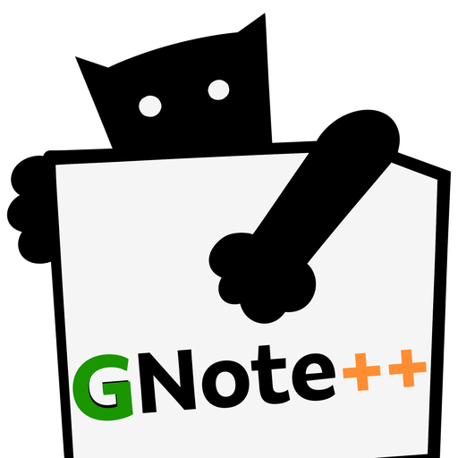
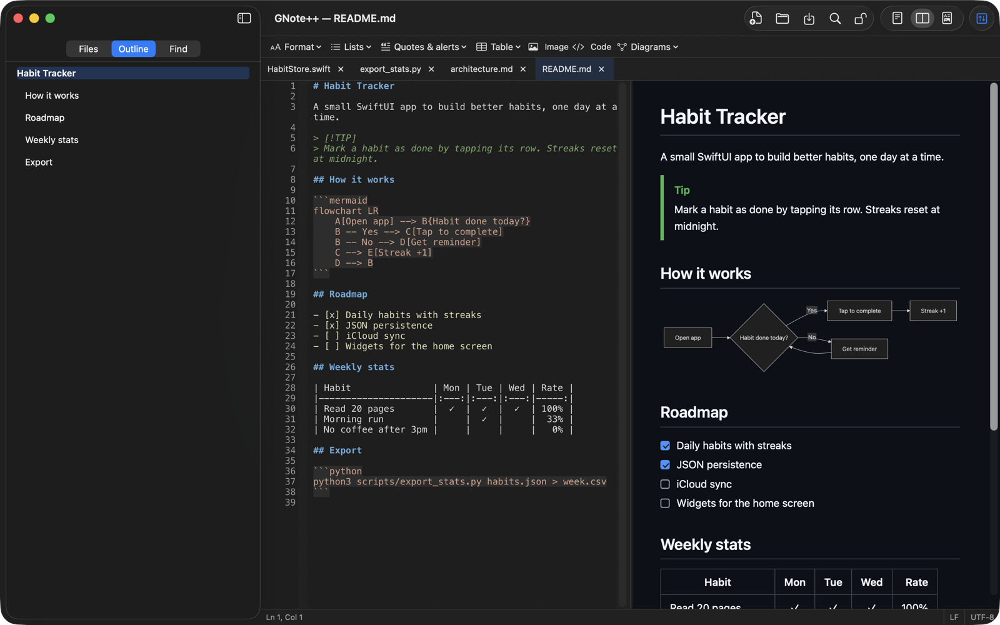
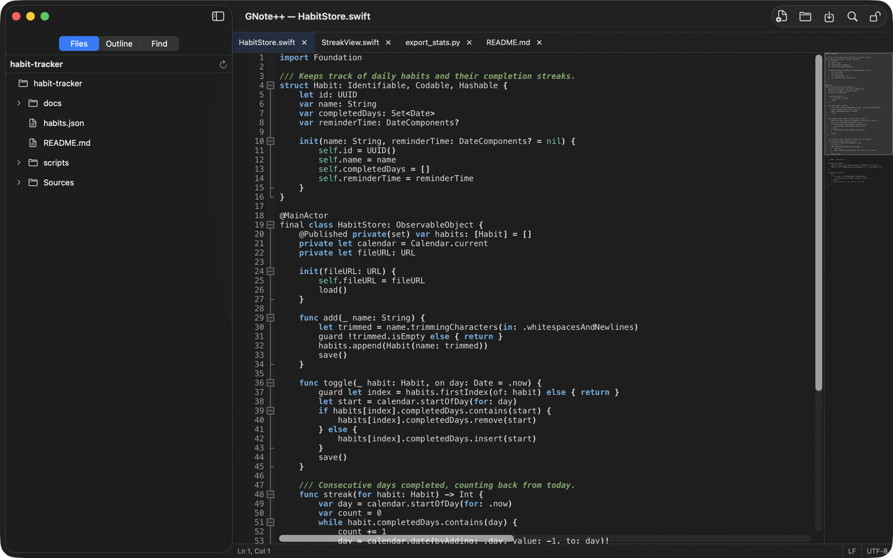
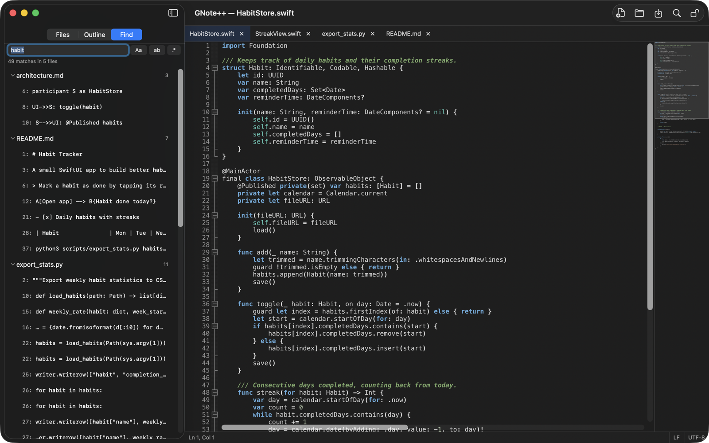

<p align="center"></p>

# GNote++ — Markdown and code editor for macOS

[](https://github.com/jcubillosz/gnote-plus-plus/releases/latest)


[](LICENSE)
[](https://www.paypal.com/donate/?hosted_button_id=Q2E7M3ZS53NF8)

**English** · [Español](#español) · [Website](https://jcubillosz.github.io/gnote-plus-plus/)

GNote++ is a free, open-source **Markdown and code editor for Mac**, built on
the source code of [Notepad++](https://notepad-plus-plus.org/). Write **AI
prompts, docs and web content** with a live preview and **Mermaid diagrams**,
on top of the [Scintilla](https://www.scintilla.org/) editing engine and the
syntax highlighting of every Notepad++ language. A native SwiftUI app — no
Wine, no emulation. Signed and notarized by Apple.

**[Download GNote++ for macOS (.dmg)](https://github.com/jcubillosz/gnote-plus-plus/releases/latest)**



## Who it's for

- **Prompt engineers** — system prompts, prompt libraries, `CLAUDE.md` and
  `AGENTS.md` are Markdown. See them rendered as you write, navigate them from
  the outline, sketch agent flows in Mermaid, and lock a finished prompt
  against accidental edits.
- **Web and content editors** — posts and pages for Markdown-based sites;
  pasted images are saved next to the file; GitHub-style preview.
- **Technical writers** — READMEs, runbooks and docs with alerts, task lists,
  diagrams (PNG/SVG export) and PDF export.
- **Developers** — every Notepad++ language, regex search, find in files,
  multi-cursor editing, minimap.

## Markdown, done properly

- **Editor, split or preview-only view**; double-click the preview to jump to
  the source line.
- **GitHub Flavored Markdown**: tables, task lists you can tick in the preview,
  alerts (`> [!NOTE]`, `[!WARNING]`…), strikethrough, autolinks.
- **Mermaid diagrams** (flowchart, sequence, class, state, Gantt, pie, mind
  map…) with templates; export as PNG or SVG.
- Syntax-highlighted code blocks in the preview, formatting toolbar, list
  continuation, table formatting (⌥⌘T), image paste and drag-and-drop.
- Heading outline in the sidebar; print and PDF export; spell checker (English
  and Spanish).
- **Private by design**: the preview runs no JavaScript and diagrams render
  offline.

## And a full code editor

- **Syntax highlighting** for every language Notepad++ supports, with its same
  definitions and color themes; light and dark mode.
- Bookmarks, code folding, change history, brace and tag matching, smart
  highlight, **multi-cursor and column editing**, autocompletion, line
  operations, function list, **minimap**.
- **Find and replace** with regular expressions, plus **find in files** across a
  folder.
- **Encoding and line-ending detection** (UTF-8, Latin-1, CRLF…) preserved on
  save; tabs, file tree, session restore, reload of files changed on disk.
- Interface in English and Spanish.





## How it differs from Notepad++

| | Notepad++ | GNote++ |
|---|---|---|
| Runs on | Windows | macOS, native app |
| Markdown | Syntax highlighting; preview via third-party plugins | Built-in live preview, Mermaid, outline, toolbar, PDF export |
| Languages and themes | Notepad++ definitions | The same definitions and themes |
| Editing engine | Scintilla | Scintilla |
| License | GPL-3.0, free | GPL-3.0, free |

GNote++ is not affiliated with or endorsed by Notepad++.

## What's new in 1.3.1

- **English interface**: on Macs set to English the app showed up in Spanish,
  because a formatting error in the translations file made macOS discard it
  entirely. It now follows the system language.

[Full release history](https://jcubillosz.github.io/gnote-plus-plus/changelog/)

## Support the project

GNote++ is free and built in spare time. If it saves you time, a
[donation via PayPal](https://www.paypal.com/donate/?hosted_button_id=Q2E7M3ZS53NF8)
helps keep it maintained and pays for the Apple developer account that lets it
open without security warnings.

---

## Español

GNote++ es un **editor de Markdown y código, gratuito, de código abierto para
macOS**, basado en el código fuente de [Notepad++](https://notepad-plus-plus.org/).
Pensado para escribir **prompts de IA, documentación y contenido web** con
vista previa en vivo y **diagramas Mermaid**, sobre el motor de edición y el
coloreado de sintaxis de Notepad++.

No es un port de la interfaz Win32 ni una capa de compatibilidad: la UI está
escrita de cero en SwiftUI y usa [Scintilla](https://www.scintilla.org/) como
componente de edición. Lo que se reutiliza de Notepad++ es su lógica de datos —
la detección de codificación (uchardet) y las definiciones de lenguajes y temas
(`langs.model.xml`, `stylers.model.xml`).

[Sitio web en español](https://jcubillosz.github.io/gnote-plus-plus/es/) ·
[Donar con PayPal](https://www.paypal.com/donate/?hosted_button_id=Q2E7M3ZS53NF8)

---

## Descargar

**[GNote++.dmg — v1.3.1](releases/v1.3.1/GNote++.dmg)** (también en
[Releases](https://github.com/jcubillosz/gnote-plus-plus/releases/tag/v1.3.1)).
Firmado con Developer ID y notarizado por Apple — se abre sin advertencias de
Gatekeeper.

### Novedades en 1.3.1

- **Interfaz en inglés**: en Mac configurados en inglés la app se mostraba en
  español, porque un error de formato en el archivo de traducciones hacía que
  macOS lo descartara completo. Ahora sigue el idioma del sistema.

[Historial completo de versiones](https://jcubillosz.github.io/gnote-plus-plus/es/changelog/)

## Qué hace

- **Editor Scintilla** con pestañas, árbol de archivos y temas claro y oscuro
  que siguen al sistema.
- **Coloreado de sintaxis** para todos los lenguajes de Notepad++, usando sus
  mismas definiciones y paletas, con negrita y cursiva.
- **Codificación y fin de línea**: se detectan al abrir y se conservan al
  guardar. Un archivo Latin-1 con CRLF se guarda como Latin-1 con CRLF.
- **Buscar y reemplazar** con expresiones regulares, coincidencia de
  mayúsculas, palabras completas, wrap-around y resaltado de todas las
  coincidencias.
- **Markdown**: coloreado en el editor y vista previa en vivo compatible con
  GitHub Flavored Markdown (tablas, listas de tareas, tachado, autolinks),
  renderizada con [cmark-gfm](https://github.com/github/cmark-gfm).
- Ir a la línea o a una posición, archivos recientes, restaurar la última
  pestaña cerrada, renombrar archivos.
- Interfaz en **español e inglés**, siguiendo el idioma del sistema.

## Requisitos

- macOS 13 o superior
- Xcode Command Line Tools (para compilar)

## Compilar

No hay proyecto de Xcode: es un paquete de Swift Package Manager.

```bash
cd mac/NppMacPOC
swift build
./scripts/make_app_bundle.sh
open .build/GNote++.app
```

`make_app_bundle.sh` arma el `.app` a mano a partir del binario de SwiftPM y lo
firma ad-hoc, que es lo que exige arm64 para poder ejecutarlo.

> El paquete alcanza `PowerEditor/`, `lexilla/` y `scintilla/` por symlinks
> relativos, así que hay que clonar el repositorio completo. Compilar solo la
> carpeta `mac/` no funciona.

## Créditos

GNote++ existe gracias al trabajo de otros:

| Componente | Autor | Licencia |
|---|---|---|
| [Notepad++](https://github.com/notepad-plus-plus/notepad-plus-plus) | Don Ho | GPL-3.0 |
| [Scintilla](https://www.scintilla.org/) · [Lexilla](https://www.scintilla.org/Lexilla.html) | Neil Hodgson | HPND |
| [uchardet](https://www.freedesktop.org/wiki/Software/uchardet/) | Mozilla · Free Software Foundation | MPL-1.1 |
| [pugixml](https://pugixml.org/) | Arseny Kapoulkine | MIT |
| [cmark-gfm](https://github.com/github/cmark-gfm) | John MacFarlane · GitHub | BSD-2 |
| [Boost.Regex](https://www.boost.org/doc/libs/release/libs/regex/) | John Maddock | BSL-1.0 |
| [Mermaid](https://mermaid.js.org/) | Knut Sveidqvist y colaboradores | MIT |

GNote++ no está afiliado a Notepad++ ni cuenta con su respaldo, y no usa su
nombre, su ícono ni su imagen de marca.

## Licencia

GPL-3.0, heredada de Notepad++. Ver [LICENSE](LICENSE).

Eso incluye tu derecho a obtener, estudiar, modificar y redistribuir este
código fuente.

## Apoyar el proyecto

Si GNote++ te resulta útil, puedes contribuir a su desarrollo:

**[Donar vía PayPal](https://www.paypal.com/donate/?hosted_button_id=Q2E7M3ZS53NF8)**
